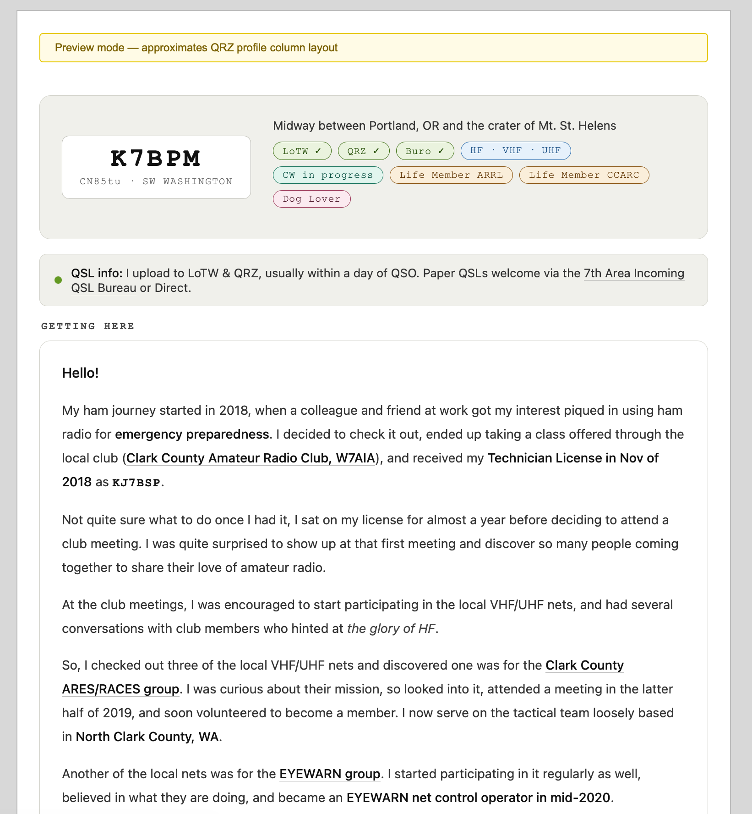
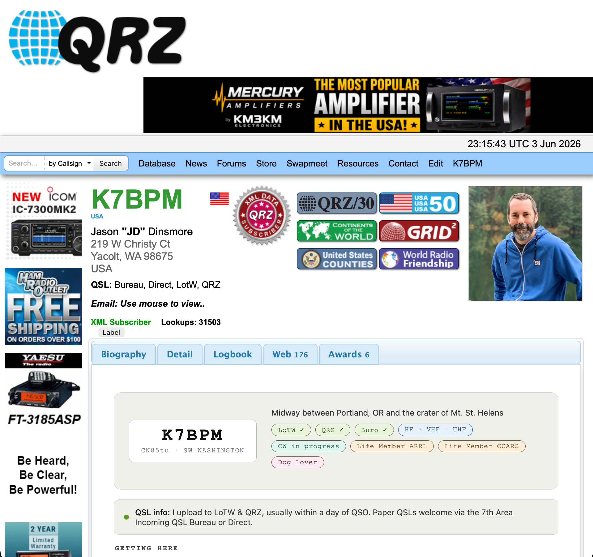
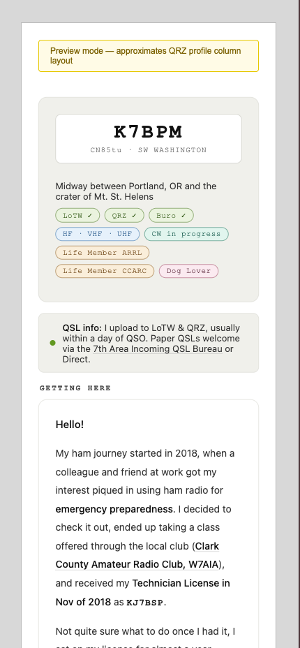

# K7BPM QRZ Profile

Source for my [QRZ.com](https://qrz.com) profile page — a hand-tuned HTML/CSS
snippet that gets pasted into QRZ's profile editor.

## Preview



Running live on QRZ, and collapsing to a single column on narrow screens:

| In the wild on QRZ | Responsive (mobile) |
| --- | --- |
|  |  |

## Files

- `profile.html` — the profile snippet (paste this into QRZ's profile editor)
- `preview.html` — local preview wrapper
- `.context/` — project notes and AI-assistant guidance

## AI Context

The `.context/` directory contains project notes and guidance for AI coding
assistants. It documents the file structure, local-preview workflow, design
constraints, and an explicit content-editing policy.

The goal is simple: AI can help with layout, styling, and implementation, but
the profile content remains intentionally written and maintained by me.

## Local Preview

```bash
python3 -m http.server 8000
```

Then open [http://localhost:8000/preview.html](http://localhost:8000/preview.html) in a browser.
(The preview fetches `profile.html`, so it needs to be served over HTTP — opening
the file directly won't work.)

## Disclaimer

Unofficial. Not affiliated with or endorsed by QRZ LLC / qrz.com.
